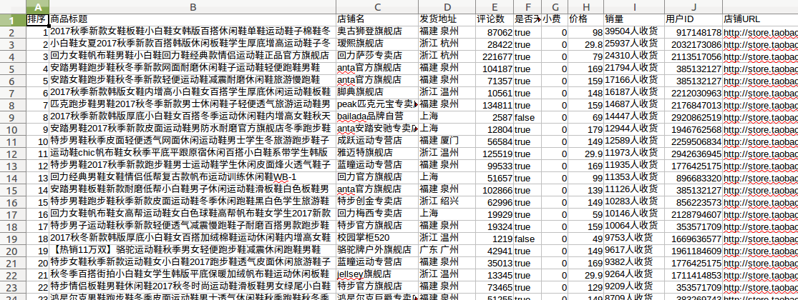

# 项目： 淘宝天猫小工具

[](https://github.com/hunterhug/GoTaobao/network)
[](https://github.com/hunterhug/GoTaobao/stargazers)
[](https://github.com/hunterhug/GoTaobao)
[](https://goreportcard.com/report/github.com/hunterhug/GoTaobao)
[](https://github.com/hunterhug/GoTaobao/issues)
[](https://raw.githubusercontent.com/hunterhug/GoTaobao/master/LICENSE)

# 介绍
使用速度快的Golang语言，编译成单一exe二进制文件，方便快捷！依赖[Marmot(Tubo) - Golang Web Spider/Crawler/Scrapy Package](https://github.com/hunterhug/GoSpider),  持续开发中....

功能列表如下：

列表页可做：

1. [done]搜索框列表 
2. 店铺所有宝贝列表

详情页可做：

1. 宝贝详情
2. [done]主图
3. 商品主图隔壁
4. 商品评论

## 使用 

请先安装Golang环境，拉下代码： `go get github.com/hunterhug/GoTaobao`

然后`./build.sh`，直接点击二进制，如`exe`即可， 你可以在[此页]()下载

运行命令行（按提示操作）：

```
$ ./GoTaoBao_linux_amd64
```

## 淘宝天猫关键字框搜索小工具（开发结束）

广告商品会置顶，不理会！综合排序可能千人千面！可能在一瞬间有不一样的结果，仅供参考



## 淘宝天猫啥啥图片小工具（开发结束）


# Support

我的工作桌面是这样的：


如果你觉得项目帮助到你,欢迎请我喝杯咖啡,或加QQ：459527502

微信


支付宝


# License

啥啥版权都没有，随便用！！！
